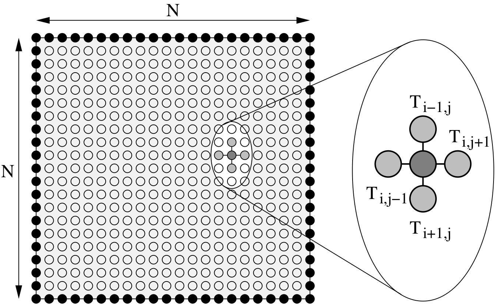
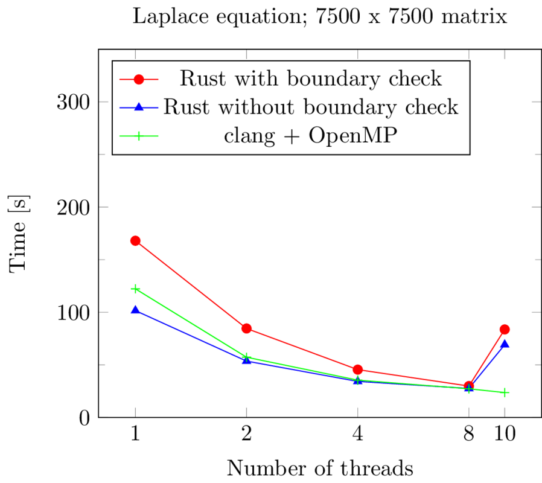

= Rust als sichere Sprache für systemnahe und parallele Software
:revealjs_theme: solarized
// [...] other document attributes
:source-highlighter: highlightjs
:revealjs_progress: true
:revealjs_slideNumber: true
:revealjs_history: true
:highlightjs-theme: solarized-dark.css

== !
|===
|Stefan Lankes | Jens Breitbart

| image:images/stl.png[width=100] | 

| https://github.com/stlankes[github.com/stlankes] | https://github.com/jbreitbart[github.com/jbreitbart]

| https://rwth-os.github.io/eduOS-rs/[eduOS-rs],  http://www.hermitcore.org[HermitCore] | https://www.jensbreitbart.de/[jensbreitbart.de]

| System Software @ RWTH | _Here for fun and no profit_

|===

== Hinweise zum Vortrag

* Folien: https://stlankes.github.io/rust_parallel2018/
* Beispiele: https://github.com/stlankes/rust_parallel2018
* Einstieg: https://www.rust-lang.org
* Playground: https://play.rust-lang.org
* Tutorial: https://rustbyexample.com

[source, bash]
----
curl https://sh.rustup.rs -sSf | sh
----

== Was ist Rust?

Rust ist eine (relativ) neue Programmiersprache für systemnahe Software

[source, Rust]
----
fn main() {
    // Die Statements werden ausgeführt sobald
    // das compilierte Binary gestartet wird.

    // Ausgabe auf stdout
    println!("Hello para//el 2018!");
}
----

Bekannt u.a. für den Einsatz in Firefox

=> Rust Code läuft somit auf Millionen von Rechnern

[NOTE.speaker]
--
Frage ans Publikum:
* Wer kennt Rust?
* Wer hat schonmal Code in Rust geschrieben?
* Wessen Code hat auch compiliert?
C-Ähnliche Syntax
Nicht nur Einsatz in Firefox:
* game engines
* operating systems
* file systems
--

=== Woher kommt Rust?

image::images/rust.png[width=150]

* Rust ist ein open-source (MIT + Apache) Projekt
* Wird aktuell primär von Mozilla Research gesponsort
* Die Weiterentwicklung selbst wird allerdings stark durch die Community getrieben

[NOTE.speaker]
--
--

=== Vorteile von Rust

* C/C++ ähnliche Performance
** http://benchmarksgame.alioth.debian.org/u64q/compare.php?lang=rust&lang2=gpp[Link zu Vergleichsmessungen]
* Compilerbasierte Überprüfungen welche z.B.
** Speichersicherheit (ohne Garbage Collection) garantieren
** Data Races verhindern

=> _Falscher_ Code compiliert nicht

[NOTE.speaker]
--
--

=== Safety vs Speed

.URL: http://thoughtram.io/rust-and-nickel/#/11
image:images/comparsion.png[jhh, width=600]

[NOTE.speaker]
--
--

=== Einfache Integration von C

[source, Rust]
----
#[repr(C)]
struct RustObject {
    number: c_int
}

#[link(name = "libprinto")]
extern {
    fn c_print_object(object: *mut RustObject) -> c_int;
}

fn main() {
    let mut rust_object = /* TODO */;

    unsafe { c_print_object(&mut *rust_object); }
}
----

[NOTE.speaker]
--
--

== Ownership & Borrowing

[source, C++]
----
std::vector<std::string>* x = nullptr;

{
	std::vector<std::string> z;

	z.push_back("Hello para//el 2018!");
	x = &z;
}

std::cout << (*x)[0] << std::endl;
----

[NOTE.speaker]
--
In der Realität verteilt über viele Files + if das wieder was in den Vector pushed.
--

* Ist dieses C++-Beispiel problematisch?

=== Erlaubt Rust solche Referenzen?

[source, Rust]
----
let x;

{
	let z = vec!("Hello para//el 2018!");

	x = &z;
}

println!("{}", x[0]);
----

[NOTE.speaker]
--
--

=== Fragen wir den Compiler

[source, Rust]
----
error[E0597]: `z` does not live long enough
  --> src/main.rs:9:8
   |
9  |         x = &z;
   |              ^ borrowed value does not live long enough
10 |     }
   |     - `z` dropped here while still borrowed
...
13 | }
   | - borrowed value needs to live until here
----

[NOTE.speaker]
--
--

=== Ownership

* Variablen werden an *einen* Besitzer (_Owner_) gebunden
* Wird der Scope des Besitzers verlassen, wird die Variable freigeben
* Yehuda Katz: _Ownership is the right to destroy_

[NOTE.speaker]
--
--

=== Borrowing

* Mit Hilfe von Referenzen kann der Besitzt ausgeliehen werden
* Der Besitz geht automatisch wieder zurück, wenn die Referenz nicht mehr existiert

.Sind die geschweiften Klammern nötig?
[source, Rust]
----
let mut v = vec!("Hello para//el 2018!");

{
	let x = &mut v;
	// Do something with x...
}

println!("{}", v[0]);
----

[NOTE.speaker]
--
--

== Ein einfaches Beispiel: Pi

image::images/pi.png[width=600]

[NOTE.speaker]
--
--

=== Pi-Berechnung in C

* Für *num_steps* Rechtecke die Höhen bestimmen
* Höhen Aufsummieren, zum Schluß mit der Breite multiplizieren

[source, C++]
----
const int num_steps = 100000000;

double sum = 0.0;
double step = 1.0 / (double)num_steps;

for (int i = 0; i < num_steps; i++) {
    double x = (i + 0.5) * step;
    sum += 4.0 / (1.0 + x * x);
}

std::cout << "PI = " <<  sum * step << std::endl;
----

[NOTE.speaker]
--
--

=== Pi-Berechnung in Rust

* Äquivalenter Code in Rust

[source, Rust]
----
const NUM_STEPS: u64 = 100000000;
let step = 1.0 / NUM_STEPS as f64;
let mut sum = 0.0;

for i  in 0..NUM_STEPS {
    let x = (i as f64 + 0.5) * step;
    sum += 4.0 / (1.0 + x * x);
}

println!("Pi: {}", sum * step);
----

[NOTE.speaker]
--
--

== Parallele Berechnung

* Verteilung der Rechtecke über die Threads
* Hier: Wettlaufsituation um die Variable **sum**

[source, C++]
----
const double step = 1.0 / NUM_STEPS;
double sum = 0.0;

std::thread t([&](int start, int end){

    for (int i = start; i < end; i++) {
    	double x = (i + 0.5) * step;
    	sum += 4.0 / (1.0 + x * x);
    }

}, (NUM_STEPS / nthreads) *  tid
 , (NUM_STEPS / nthreads) * (tid + 1));

----

[NOTE.speaker]
--
--

=== Berechnung mit Rust

* Versuch einer Wettlaufsituation in Rust

[source, Rust]
----
let step = 1.0 / NUM_STEPS as f64;
let mut sum = 0.0 as f64;

let threads: Vec<_> = (0..nthreads)
    .map(|tid| {
        thread::spawn(|| {
            let start = (NUM_STEPS / nthreads) * tid;
            let end = (NUM_STEPS / nthreads) * (tid+1);

            for i in start..end {
                let x = (i as f64 + 0.5) * step;
                sum += 4.0 / (1.0 + x * x);
            }
        })
    }).collect();

for t in threads {
    t.join().unwrap();
}
----

[NOTE.speaker]
--
--

=== Compiler schlägt Alarm

* Ausgeliehene Objekte könnten das Original überleben

[source, Rust]
----
   |
37 | thread::spawn(|| {
   |               ^^ may outlive borrowed value `**step`
...
42 |    let x = (i as f64 + 0.5) * step;
   |                               ---- `**step` is borrowed
help: to force the closure to take ownership of `**step`
   |
37 |    thread::spawn(move || {
   |                  ^^^^^^^
----

=> Ein std::thread darf nur auf Variablen zugreifen die er besitzt oder welche _static lifetime_ haben.

[NOTE.speaker]
--
--

=== Berechnung mit Rust

* Übergabe der Ownership (Compiler Vorschlag)

[source, Rust]
----
let step = 1.0 / NUM_STEPS as f64;
let mut sum = 0.0 as f64;

let threads: Vec<_> = (0..nthreads)
    .map(|tid| {
        thread::spawn(move || 	{
            let start = (NUM_STEPS / nthreads) * tid;
            let end = (NUM_STEPS / nthreads) * (tid+1);

            for i  in start..end {
                let x = (i as f64 + 0.5) * step;
                sum += 4.0 / (1.0 + x * x);
            }
        })
    }).collect();
----

[NOTE.speaker]
--
--

=== Compiler schlägt Alarm

* Objekte werden als unveränderliche übergeben
* Wettlaufsituation wird verhindert
* Aber keine Lösung für die Pi-Berechnung

[source, Rust]
----
error: cannot assign to immutable captured outer variable
   |
43 |   sum += 4.0 / (1.0 + x * x);
   |   ^^^^^^^^^^^^^^^^^^^^^^^^^^
----

[NOTE.speaker]
--
--

== Schutz statischer Elemente

* Statische Element können gelesen werden
* *unsafe*-Blöcke für Änderungen zwingend nötig
** Entwickler wird sich den Gefahren bewußt

[source, Rust]
----
static readonly_number: u64 = 42;
static mut counter: u64 = 0;

pub fn init() {
    let i = readonly_number;

    unsafe {
        counter = i;
    }
}
----

[NOTE.speaker]
--
--

=== Gemeinsame Variablen

* Heap-Allokation ermöglicht längere Lebenszeit
** Speicherschutz über _reference counting_
** `std::{Rc|Arc}<T>` alloziert `T` auf dem Heap
** `std::Arc` is thread-sicher
* _scoped Threads_ aus dem Crossbeam crate ähnlich dem OpenMP Thread Modell

=> Bis jetzt aber nur unveränderliche Variablen

[NOTE.speaker]
--
--

=== Zugriffsschutz mit Mutexen / RWLock

* Rust-Mutexe nehmen zuschützendes Objekt auf
* *lock*-Methode liefert Objekt zum Zugriff zurück
* Automatische Freigabe nach Zerstörung des Objekts

[source, Rust]
----
static readonly_number: u64 = 42;
static counter: Mutex<u64> = Mutex::new(0);

pub fn init() {
    let guard = counter.lock().unwrap();
    guard = readonly_number;
}
----

* RWLock bietet ein ähnliches Interface.

[NOTE.speaker]
--
--

=== Atomare Variablen

* Atomare Variablen (`std::sync::atomic::*`)
** Schwierig zu benutzen
** Folgt dem C11 Speichermodell mit Acquire/Release Semantik

[source, Rust]
----
let reference_count: AtomicUsize = 0;
reference_count.fetch_add(1, Ordering::Relaxed);
----

=> Der trait `std::marker::Sync` muß für gemeinsame veränderliche Variablen implementiert werden

[NOTE.speaker]
--
--

== Parallele Berechnung

[source, Rust]
----
let sum = Arc::new(Mutex::new(0.0 as f64));

let threads: Vec<_> = (0..nthreads).map(|tid| {
    let sum = sum.clone();

    thread::spawn(move || {
        let start = (NUM_STEPS / nthreads) * tid;
        let end = (NUM_STEPS / nthreads) * (tid+1);
        for i in start..end {
            let x = (i as f64 + 0.5) * step;
            *sum.lock().unwrap() += 4.0 / (1.0 + x * x);
        }
    })
}).collect();
----

[NOTE.speaker]
--
--

=== Berechnung mit Teilergebnissen

* Der Mutex serialisiert die Berechnung
* Idee: Teilergebnisse berechnen & zusammenführen

[source, Rust]
----
let step = 1.0 / NUM_STEPS as f64;
let sum = 0.0 as f64;

let threads: Vec<_> = (0..nthreads)
	.map(|tid| {
		thread::spawn(move || {
			let mut partial_sum = 0 as f64;
			let start = (NUM_STEPS/nthreads)*tid;
			let end = (NUM_STEPS/nthreads)*(tid+1);
			for i  in start..end {
				let x = (i as f64 + 0.5) * step;
				partial_sum += 4.0 / (1.0 + x * x);
			}
			partial_sum
		})}).collect();
----

[NOTE.speaker]
--
--

=== Berechnung mit Teilergebnissen

* Der Mutex serialisiert die Berechnung
* Idee: Teilergebnisse berechnen & zusammenführen

[source, Rust]
----
for t in threads {
	sum += t.join().unwrap();
}
----

[NOTE.speaker]
--
--

=== Berechnung mit Kanälen

* Ergebnisse durch Kanäle zusammenführen
** Analogie zu *Communicating Sequential Processes* (CSP) und *Coroutines*

[source, Rust]
----
fn term(start: u64, end: u64) -> f64
{
    let step = 1.0 / NUM_STEPS as f64;
    let mut sum = 0.0;

    for i in start..end {
        let x = (i as f64 + 0.5) * step;
        sum += 4.0 / (1.0 + x * x);
    }

    sum
}
----

[NOTE.speaker]
--
--

=== Berechnung mit Kanälen

* Teilergebnisse berechnen und versenden

[source, Rust]
----
let (tx, rx) = mpsc::channel();

for id in 0..nthreads {
    let thread_tx = tx.clone();
    let start = (NUM_STEPS / nthreads as u64) * id;
    let end = (NUM_STEPS / nthreads as u64) * (id+1);

    thread::spawn(move || {
        let partial_sum = term(start, end);
        thread_tx.send(partial_sum).unwrap();
    });
};
----

[NOTE.speaker]
--
--

=== Berechnung mit Kanälen

* Ergebnisse empfangen und aufaddieren

[source, Rust]
----
let mut sum = 0.0;

for _ in 0..nthreads {
    sum = sum + rx.recv().unwrap();
}
----

* Diese Lösung skaliert wie gewünscht
* Wie sieht es mit Lastbalanzierung aus?

[NOTE.speaker]
--
--

== Rayon: Parallelism in Rust

* https://github.com/rayon-rs/rayon
* Unterstützt parallele Berechungen auf Basis von Task-Parallelität und _Work Stealing_
** Ähnlich zu Cilk (daher auch der Name)
* Biete aber auch Daten-Parallelität über Iteratoren

[NOTE.speaker]
--
rayon == Kunstseide
silk == Seide
Eingesetzt in firefox
Automatische Lastbalanzierung
--

=== Iteratoren in Rust

* Serielle Pi-Berechnung mit Hilfe von Iteratoren

[source, Rust]
----
let step = 1.0 / NUM_STEPS as f64;

let sum: f64 = (0..NUM_STEPS).into_iter()
    .map(|i| {
        let x = (i as f64 + 0.5) * step;
        4.0 / (1.0 + x * x)
    }).sum();

println!("Pi: {}", sum * (1.0 / NUM_STEPS as f64));
----

[NOTE.speaker]
--
--

=== Pi-Berechnung mit Rayon

* Parallele Pi-Berechnung mit Rayon
* Lohnt sich nur bei größeren Aufgaben

[source, Rust]
----
let step = 1.0 / NUM_STEPS as f64;

let sum: f64 = (0..NUM_STEPS).into_par_iter()
    .map(|i| {
        let x = (i as f64 + 0.5) * step;
        4.0 / (1.0 + x * x)
    }).sum();

println!("Pi: {}", sum * (1.0 / NUM_STEPS as f64));
----

[NOTE.speaker]
--
Actually things aren't that bad
--

== Das Laplace-Problem

* Wärme-Verteilung innerhalb einer Platte
* Gelöst mit _Jacobi Over Relaxation_ (JOR)

=== Lösung mit Hilfe von Tasks

image::images/laplace_task.png[width=600]

=== Lösung durch eine // For-Schleife

// == Weitere Hinweise
//
// Mal schauen ob wir das hier brauchen
// *  [T]::split_at_mut() oder [T]::chunks() um gemeinsame Datenstrukturen aufzuteilen für den borrow checker

== Zusammenfassung

* Ownership / Borrowing ist für einen _old school_ Entwickler gewönnungsbedürftig
* _Fearless concurency_
** Der Compiler verhindert _race conditions_
** std hat Threads, Mutex, RW Lock und Arc
** Rayon und Crossbeam vereinfachen viele Aufgaben

[NOTE.speaker]
--
--
